# 开发工具

::: info
终端快捷键：`ctrl`+`alt`+`t`
复制：`ctrl`+`shift`+`c`
粘贴：`ctrl`+`shift`+`v`
清屏：`ctrl`+`l`
:::

## FileZilla
FileZilla是用于Windows与Ubuntu之间文件传输的工具，使用此软件需要开启FTP服务器。

虽然VM-tools也可以进行文件的传输，但是对于大文件以及多文件，使用此软件更好。
### FileZilla下载
进入[FileZilla官网下载地址](https://www.filezilla.cn/download/client)，进行软件的下载。下载完成后根据提示进行安装。
### 开启FTP服务器
1. 在Ubuntu中，打开终端，输入`sudo apt-get update`。

```
sudo apt-get update
```

2. 安装vsftpd

```
sudo apt-get install vsftpd 
```

3. 使用 vi 命令打开/etc/vsftpd.conf 配置文件

```
sudo vi /etc/vsftpd.conf 
```

4. 修改配置文件
按下`i`键，进入编辑模式，删除`write_enable=YES`前的`#`。按下`ESC`退出编辑模式，输入`:wq`，按下回车键，完成修改。

5. 输入`sudo /etc/init.d/vsftpd restart`重启服务。

```
sudo /etc/init.d/vsftpd restart
```

6. 安装net-tools
输入`sudo apt install net-tools`.
```
sudo apt install net-tools
```
7. 查看Ubuntu的IP地址

输入`ifconfig`

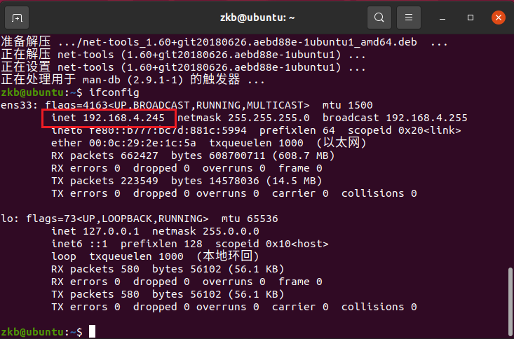

8. 打开`FileZilla`，点击文件，点击站点管理器，新建站点。
添加Ubuntu。

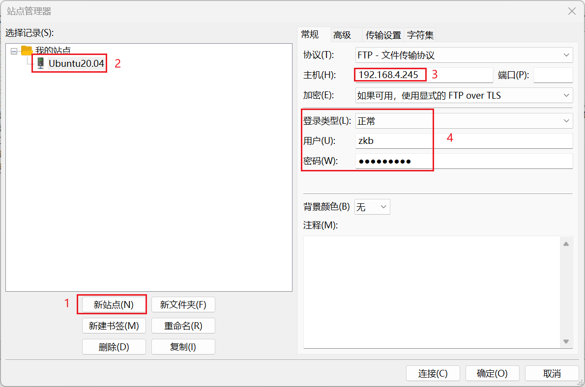

使用UTF-8编码，防止中文乱码。

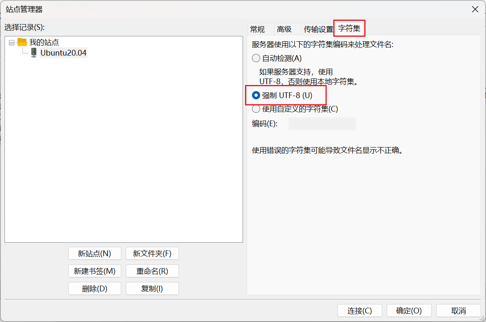

9. 连接虚拟机

成功连接到虚拟机，可以进行文件的长传和下载。

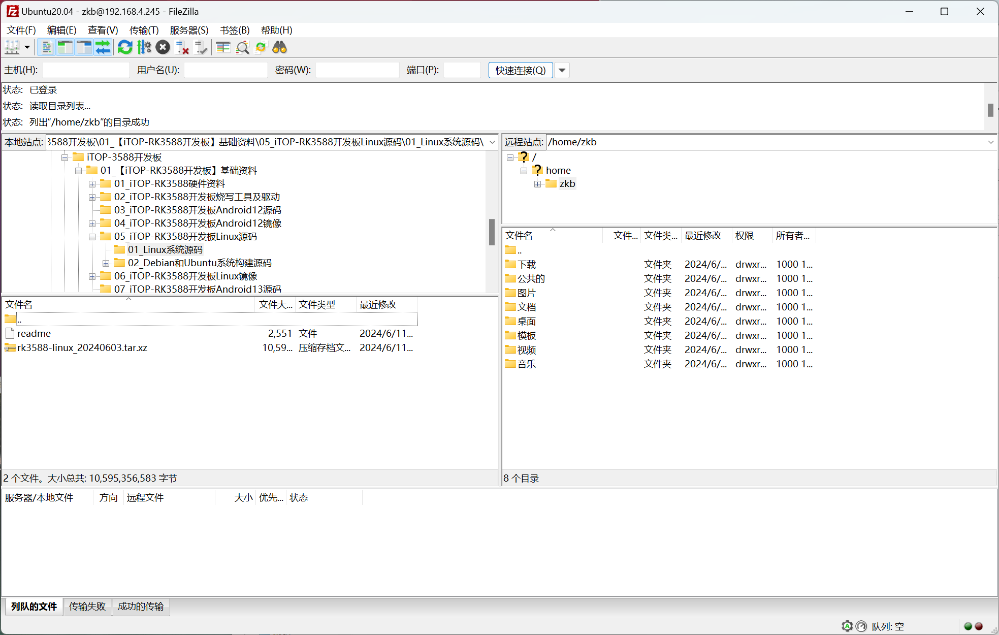
## MobaXterm

MobaXterm是一款适用于IT行业的远程终端软件，可以使用串口进行连接控制设备。

从官网下载软件。根据提示安装即可。

<CardLink
  to="https://mobaxterm.mobatek.net/download-home-edition.html"
  title="MobaXterm"
  description="MobaXterm官方下载链接"
  imageSrc="https://github.com/KB-talk/picx-images-hosting/raw/master/picture/1723454975579.73tv6eqvsx.webp"
  imagePosition="right"
/>

## Vscode
从官网获取Linux版本安装包，选择`deb`格式。

<CardLink
  to="https://code.visualstudio.com/Download"
  title="Vscode"
  description="Vscode官方下载链接"
  imageSrc="https://github.com/KB-talk/picx-images-hosting/raw/master/img/vscode.3tnwnc5rgd80.jpg"
  imagePosition="right"
/>

将下载的安装包上传到Linux虚拟机中。

打开终端，进入安装包所在目录，输入`sudo dpkg -i vscode.deb`进行安装。例如：

```c
sudo dpkg -i code_1.92.1-1723066302_amd64.deb 
```

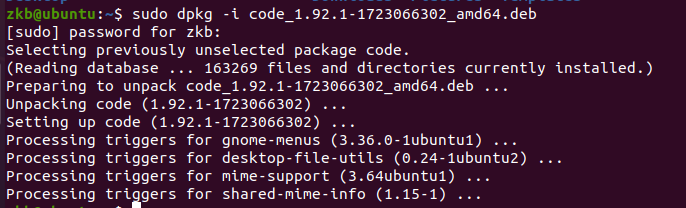

打开vscode有两种方法。一种是在终端输入`code`，另一种是在 `应用列表`中打开。

在使用vscode时，不一定在Linux中直接使用，也可以在Windows中通过ssh使用。

在Ubuntu中安装`openssh-server`。

```c
sudo apt-get install openssh-server
```

在window中，点击vscode左下角的`打开远程窗口`，选择`连接主机`，`添加新的SSH主机`，根据自己实际情况输入`ssh 用户名@IP地址 -A`。选择第一个配置，选择Linux，输入密码，即可使用vscode。

```c
ssh zkb@192.168.155.186 -A
```

## RKDevTool

RKDevTool是用于下载固件的软件，将Ubuntu编译好的固件下载到开发板中。

<CardLink
  to="https://pan.baidu.com/s/1GqSFe6L-ONjxobTBcnJULA?pwd=pesb "
  title="RKDevTool"
  description="RKDevTool百度云下载链接，提取码：pesb"
  imageSrc="https://github.com/KB-talk/picx-images-hosting/raw/master/picture/image.8hgeeqgz0v.webp"
  imagePosition="right"
/>

驱动安装后，将下载的压缩包解压后移动到软件安装目录下，打开直接使用。

::: info
1. `DriverAssitant_v5.1.1`是驱动安装包，需要安装后才可使用RKDevTool。
2. `将RKDevTool_Release_v3.15`中的`RKDevTool.exe`的快捷方式发送到桌面，便于后续使用。
:::

编译好的固件在`/home/zkb/RK3588/rk3588-linux/rockdev`中，升级固件为`update.img`。

将此固件下载到Windows中，并使用RKDevTool进行下载。

* 长按`BOOT`再按下电源键会出现`发现一个MASKROM设备`。

* 长按`VOL+`再按下电源键会出现`发现一个LOADER设备`。

::: tip 下载提示

在使用软件下载固件时，需要注意一定安装驱动，否则检测不到设备。

虚拟机需要设置USB设备自动连接到window主机，否则也会导致检测不到设备。

:::

## ADB

adb是在调试中非常重要的工具，可以使用它进行终端命令的输入以及文件的上传与下载。

### adb安装与配置

1. 从官网下载`adb`压缩包。

<CardLink
  to="https://adbdownload.com/"
  title="ADB"
  description="ADB官方下载链接"
  imageSrc="https://github.com/KB-talk/picx-images-hosting/raw/master/picture/image.32hvw8u11m.webp"
  imagePosition="right"
/>


2. 将下载的压缩包进行解压，将文件夹复制到软件安装目录。

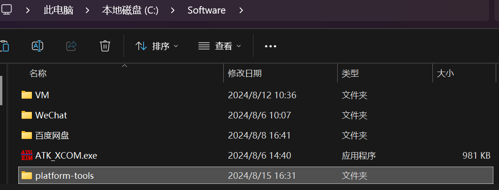

3. 将adb文件夹`platform-tools`，添加到环境变量中。

打开设置 -> 进入系统 -> 打开高级系统设置 -> 打开环境变量 -> 在系统环境变量的Path中添加

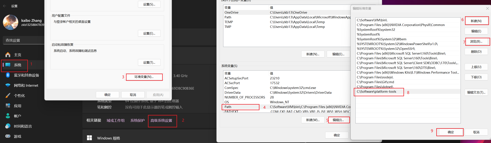

4. 在Ubuntu中安装adb，输入指令

```c
sudo apt install adb
```

5. 测试

在终端中输入`adb`，有信息打印。

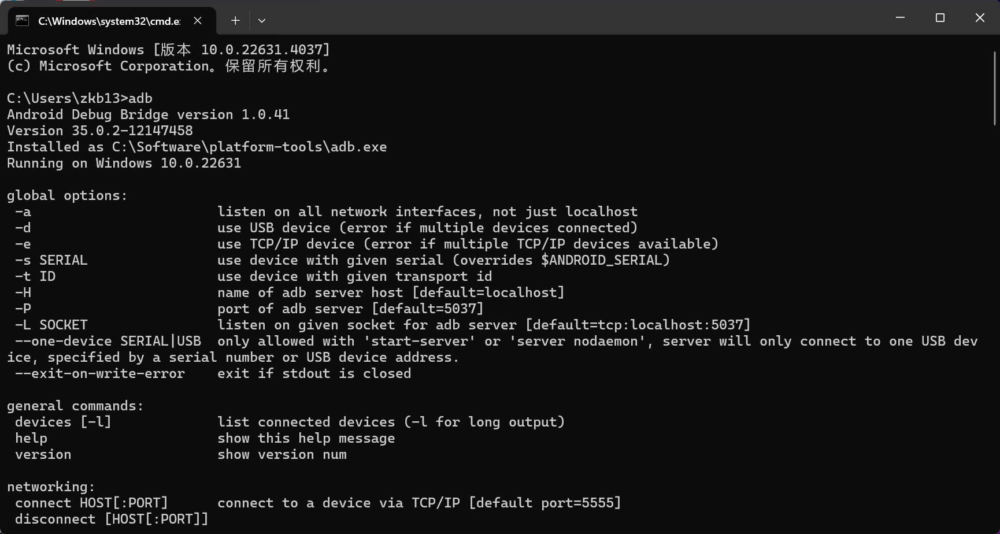

6. 使用数据线连接开发板

* 在终端中输入`adb devices`可以查看设备。

```c
adb devices
```

* 使用`adb shell`可以进入开发板，则可以使用终端控制开发板，此终端即开发板的终端。

```c
adb shell
```

* 使用`exit`退出adb，或按下`ctrl+D`，即可退出。

```c
exit
```

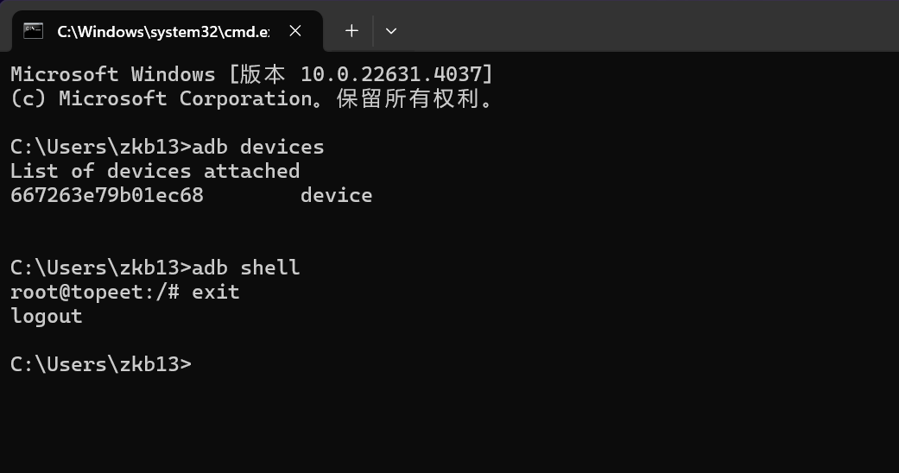

### adb常用指令

* 将本地文件上传到设备

```c
adb push [上传的文件] [目标路径]
```

* 将设备中的文件下载到本地

```c
adb pull [设备文件] [本地路径]
```

## Anaconda

<CardLink
  to="https://www.anaconda.com/"
  title="Anaconda"
  description="Anaconda官方下载链接"
  imageSrc="https://github.com/KB-talk/picx-images-hosting/raw/master/img/anaconda.2v0uyxdhjug0.jpg"
  imagePosition="right"
/>

1. 下载完成后，将文件上传到Ubuntu，使用`./文件名`进行安装。

2. 添加环境变量。

在主目录下，使用`ls -a`查看`.profile`文件。

将Anaconda中bin文件夹路径添加到环境变量中。

```
nano ~/.profile 
```

```
export PATH=/home/zkb/anaconda3/bin:$PATH
```

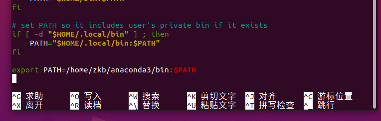

3. 注销或重启后，查看是否安装成功。

```
zkb@ubuntu:~$ conda -V
conda 24.9.2
```

::: info
1. 当提示：`bash: ./Anaconda3-2024.10-1-Linux-x86_64.sh: 权限不够`时。

打开安装包的属性，开启`允许文件作为程序执行`。

2. 开始安装时，需要根据提示长时间按住`enter`，阅读信息。
:::

::: details anaconda使用方法


1. 创建新环境

使用python3.8,创建名为rknn环境。

```
conda create -n rknn python=3.8
```

2. 开启conda

```
conda init
```

此操作是初始化conda，开启后可以使用终端执行conda命令。

window中会出现这个界面。

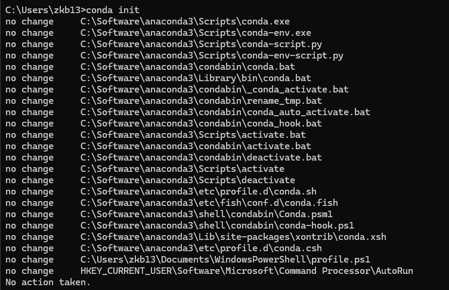

3. 切换环境

切换到rknn环境中。

```
conda activate rknn
```

```
(base) zkb@ubuntu:~/桌面$ conda activate rknn
(rknn) zkb@ubuntu:~/桌面$ 
```

默认是在base环境中，切换到rknn环境。

4. 下载软件包

```
conda install <软件名>
pip install <软件名>
```

通常推荐使用conda安装库，因为它会自动处理依赖关系。但在某些情况下，如果conda中没有可用的包版本，也可以使用pip进行安装。

5. 删除软件包

```
conda remove <软件名>
```
6. 添加下载源

7. 查看存在的环境

```
conda env list
```

8. 查看软件包

```
conda list
```

9. 删除环境

```
conda activate base
conda env remove -n <环境名>
```

10. 退出环境

```
conda deactivate
```
:::

## pycharm

<CardLink
  to="https://www.jetbrains.com/pycharm/download/?section=linux"
  title="pycharm"
  description="pycharm官方下载链接"
  imageSrc="https://github.com/KB-talk/picx-images-hosting/raw/master/img/pycharm.2fq5fu2zcvms.jpg"
  imagePosition="right"
/>

1. 下载完成后，将文件上传到Ubuntu，对文件进行解压。

```
tar -xzvf pycharm-community-2024.3.5.tar.gz
```

2. 进入`bin`文件夹。

```
cd pycharm-community-2024.3.5/bin
```

3. 使用`./pycharm.sh`运行pycharm。

4. 创建快捷方式。

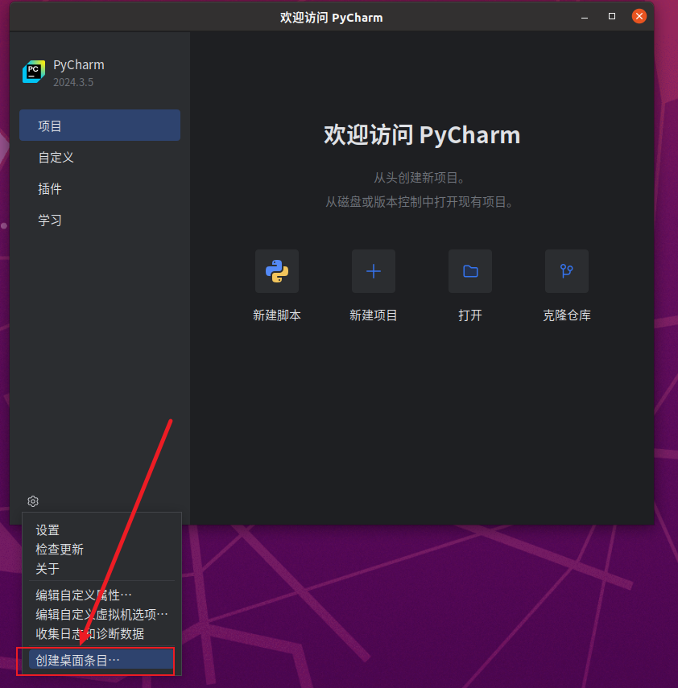

