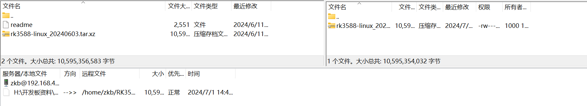

# SDK介绍

## RK3588 Linux SDK介绍
RK3588 Linux SDK 集成了 Linux Kernel 源码、U-Boot 源码以及 RK 提供的各种开发工具、文档等。

## SDK获取与编译
瑞芯微的SDK包并不开源，获取最新的SDK包需要从开发板的厂商处进行获取，下载后使用Filezila将安装包上传到Ubuntu虚拟机中。

1. 新建文件夹

```
mkdir RK3588
```

2. 将SDK压缩包上传到RK3588文件夹中

3. 使用命令解压SDK包
解压`RK3588`SDK包
```
tar -vxf rk3588-linux_20240603.tar.xz
```
解压`RV1126`SDK包
```
tar -vxf atk-rv1126_linux_release_v1.5_20240201.tar.bz2
```

4. 转到解压出的文件夹中，进行第一次全自动编译

```
./build.sh
```
::: info
第一次编译时，会下载一些依赖。
具体操作请先按照`SDK操作`章节进行操作。
:::

## SDK工程目录介绍

| 目录                  | 目录说明                                                                                     |
|:---------------------:|:------------------------------------------------------------------------------------------:|
| app                   | 存放上层应用 app，主要是 qcamera/qfm/qplayer/settings 等一些应用程序。                     |
| buildroot             | 基于 buildroot (2021.11) 开发的根文件系统。                                               |
| debian                | 基于 debian 10 开发的根文件系统，支持部分芯片。                                           |
| device/rockchip/elf2  | 存放 elf2 配置和 Parameter文件，以及一些编译与打包固件的脚本和预备文件。                  |
| docs                  | 存放芯片模块开发指导文档、平台支持列表、芯片平台相关文档、Linux开发指南等。               |
| IMAGE                 | 存放每次生成编译时间、XML、补丁和固件目录。                                               |
| external              | 存放第三方相关仓库,包括音频、视频、网络、recovery 等。                                    |
| kernel                | 存放 kernel 5.10 开发的代码。                                                             |
| prebuiltis            | 存放交叉编译工具链。                                                                      |
| rkbin                 | 存放 Rockchip 相关的 Binary 和工具。                                                      |
| rockdev               | 存放编译输出固件。                                                                        |
| tools                 | 存放 Linux 和 Windows 操作系统环境下常用工具。                                            |
| u-boot                | 存放基于 v2017.09 版本进行开发的 uboot 代码。                                             |
| yocto                 | 基于 yocto gatesgarth 3.2 开发的根文件系统，支持部分芯片。                                |

## 内核目录介绍

| 目录             | 目录说明                                                                                     |
|:----------------:|:------------------------------------------------------------------------------------------|
| arch/            | 可支持的不同 CPU 架构下的核心代码。例如 arm 就是 arm 架构相关的代码，arm 目录下包括很多处理器平台，也包括了启动代码 boot、架构相关配置文件 configs、内核相关文件 kernel、内存管理 mm 和库 lib 等 |
| block/           | 块设备相关通用函数                                                                         |
| crypto/          | 常见的加密算法相关代码                                                                     |
| Documentation/   | 说明文档，对每个目录和模块有详细说明                                                       |
| drivers/         | 设备驱动程序，其中每一个目录都代表一种设备驱动                                             |
| fs/              | 可支持的文件系统相关代码                                                                   |
| include/         | 通用的头文件                                                                               |
| init/            | 内核初始化核心代码                                                                         |
| ipc/             | 内核进程间通信相关代码                                                                     |
| kernel/          | 内核核心代码，目录下实现了多数 Linux 系统的内核函数                                        |
| lib/             | 内核共用的函数库                                                                           |
| mm/              | 内存管理相关代码                                                                           |
| net/             | 网络相关代码                                                                               |
| sample/          | 示例代码                                                                                   |
| scripts/         | 用于内核配置的脚本文件，用于实现内核配置的图形界面                                         |
| security/        | 安全性相关，支持安全操作系统相关代码。包括 SELinux、Apparmor、Smack 和 TOMOYO Linux 安全模块。 |
| sound/           | 音频相关代码                                                                               |
| tools/           | 常用工具代码                                                                               |
| usr/             | 内核启动相关代码                                                                           |
| virt/            | 内核虚拟化相关代码                                                                         |


