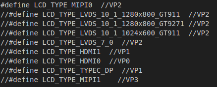
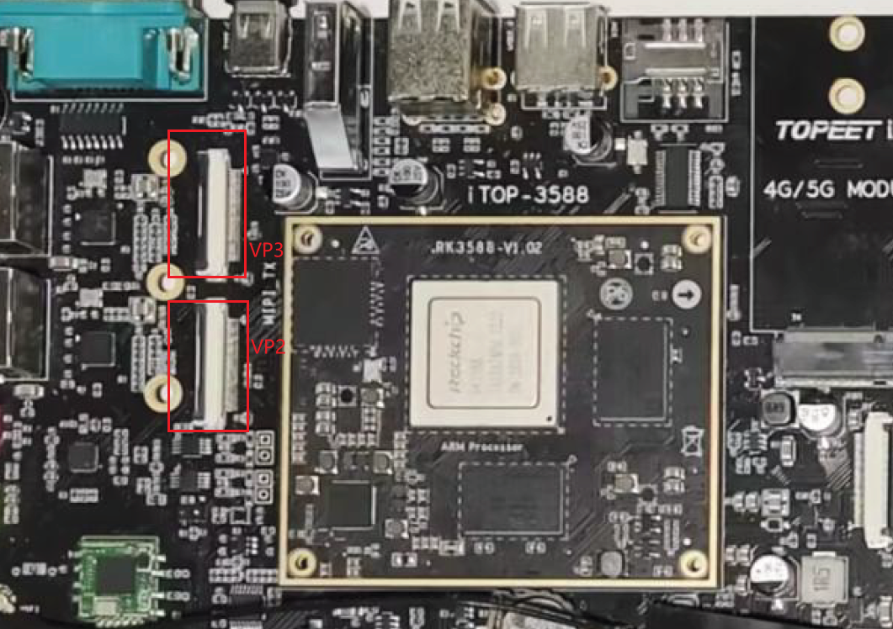

# 屏幕及摄像头配置

## 配置屏幕

开发板配套的屏幕是`迅为7寸屏幕`。

1. 修改`/home/zkb/RK3588/rk3588-linux/kernel/arch/arm64/boot/dts/rockchip`中的`topeet_screen_lcds.dts`。选择屏幕列表中的屏幕，VP2合VP3使用的都是MIPI屏幕，对应的接口不同。

我们选择`#define LCD_TYPE_MIPI0  //VP2`将其他屏幕注释。

2. 修改`/home/zkb/RK3588/rk3588-linux/kernel/arch/arm64/configs`中的`rockchip_linux_defconfig`。在使用MIPI屏幕时，需要确保`CONFIG_DRM_MIPI_DSI=y`被使能。

## 配置摄像头

1. 修改`/home/zkb/RK3588/rk3588-linux/kernel/arch/arm64/boot/dts/rockchip/topeet_camera_config.dtsi`，选择使用的接口。

2. 修改`/home/zkb/RK3588/rk3588-linux/kernel/arch/arm64/configs/rockchip_linux_defconfig`。使能对应的摄像头。