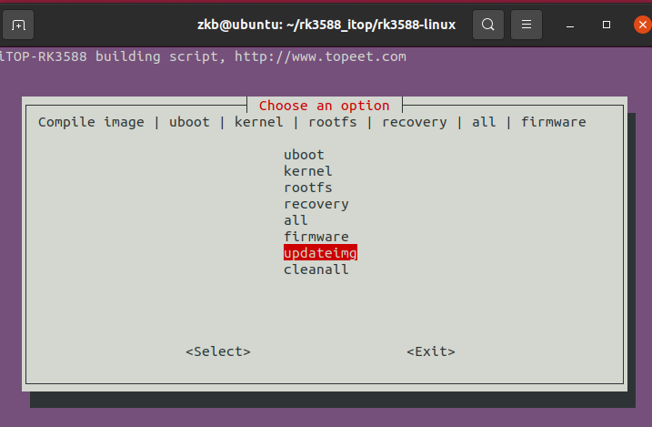
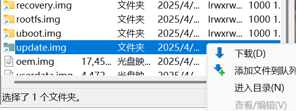
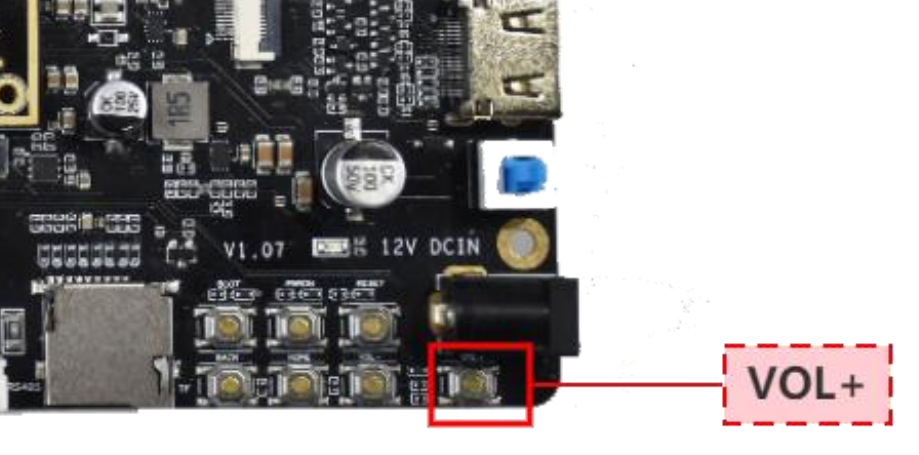
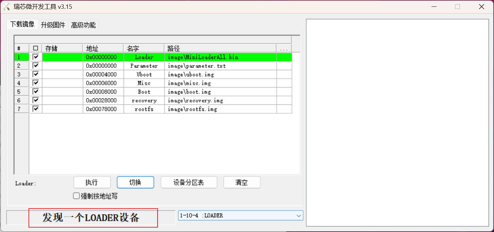
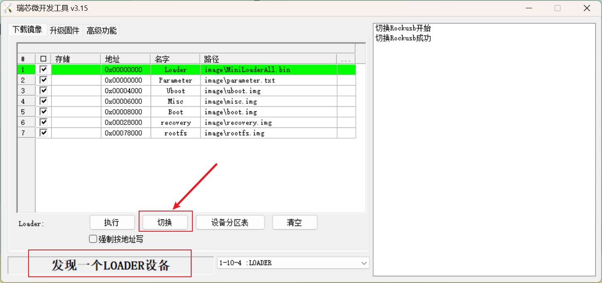
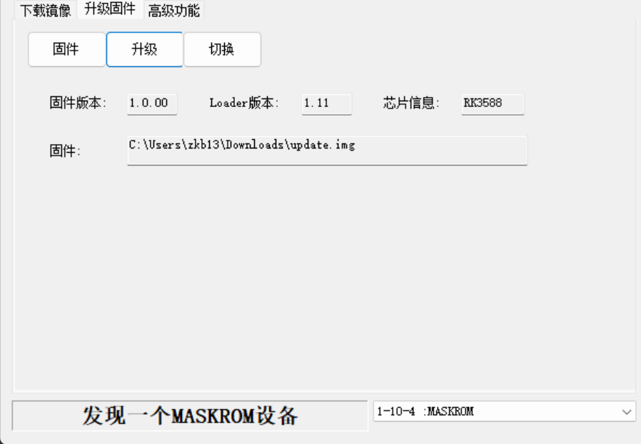
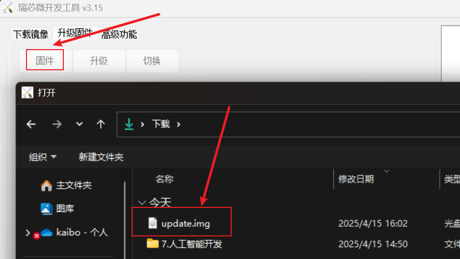
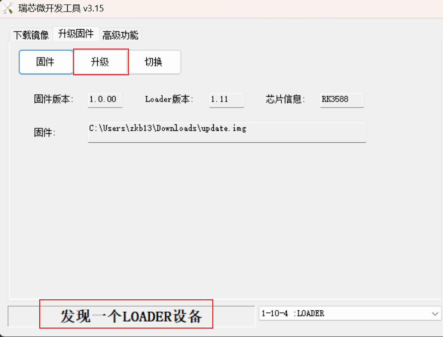

# 升级固件

## 讯为RK3588

1. 打包镜像，生成

执行`./build.sh`，选择`updataimg`。

2. 将生成的文件上传到Windows

路径：`/home/zkb/rk3588_itop/rk3588-linux/rockdev/update.img`

3. 打开RKDevTool，切换模式

切换到`loader`模式。

::: tabs#update

@tab 手动切换

在电源关闭情况下，按住`vol+`键后按下电源开关，等待设备切换到`loader`模式。

@tab 软件切换

@tab 强制进入maskrom

当芯片内部程序不能正常运行时，需要使用这种办法进行烧录。

在电源关闭情况下，按住`BOOT`键后按下电源开关，等待设备切换到`maskrom`模式。

:::

4. 选择升级固件

5. 烧录

## 飞凌rk3588